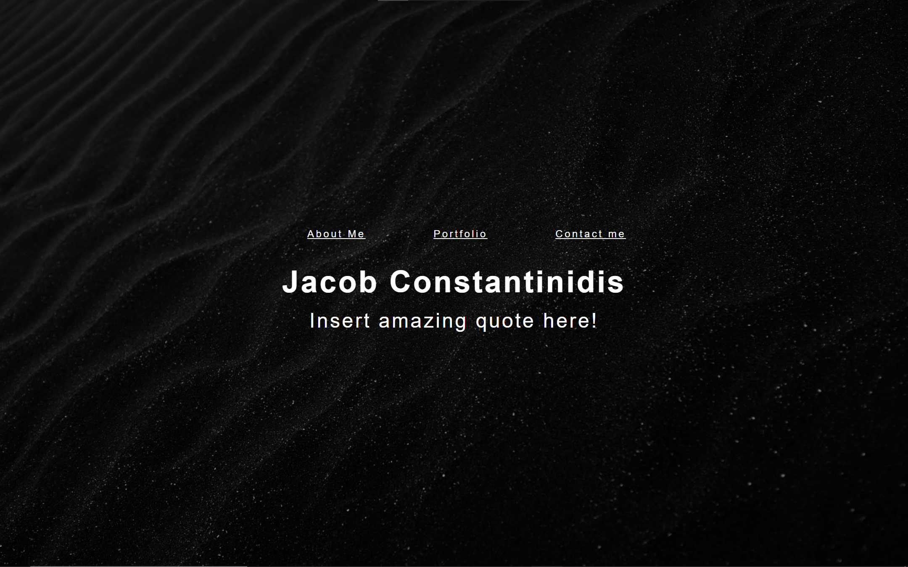
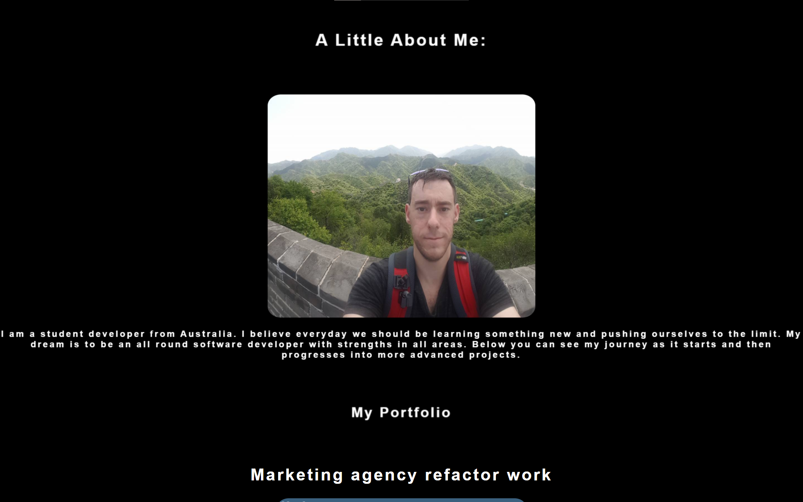
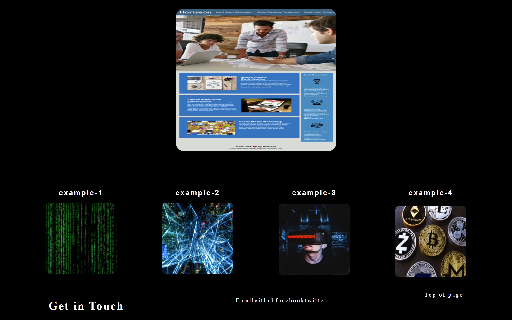

## <My Portfolio>
## Description
This is my first attempt at a portfolio landing page. It contains some information about me, as well as photos and links of projects I have completed or will complete.
- I have coded my own Portfolio landing page to showcase various projects that either are complete or will be completed in the future. This is a starting point for enabling future career growth and job opportunities.

- What problem does it solve?

  Designing this served to offer an opportunity to practice all the skills we have learned and covered so far in the full stack coding bootcamp course.

- What did you learn?

  How to better implement a variety of coding practices and attempting to make them work in harmony to have a functional website.

## Table of Contents (Optional)
If your README is long, add a table of contents to make it easy for users to find what they need.
- [Installation](#installation)
- [Usage](#usage)
- [Credits](#credits)
- [License](#license)
## Installation
Fork  my repository "My Portfolio" and open it in an editor or just view the landing page..
 
## Usage
From the github repository you may open the website as any url enables.
To add a screenshot, create an `assets/images` folder in your repository and upload your screenshot to it. Then, using the relative filepath, add it to your README using the following syntax:
    ```md
# 
    
# 
    
# 

# <a href="https://jconstant112.github.io/My-Portfolio/" target="_blank">My Portfolio</a>
    
## Credits
Jacob Constantinidis
Adelaide University
Trinity College
Google
## License
none
---

## Tests Portfolio